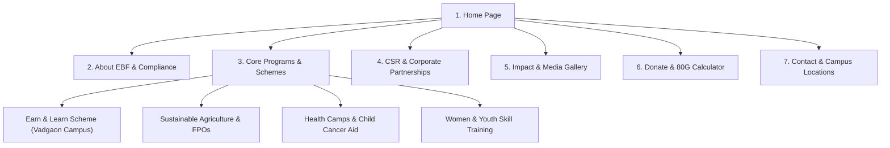

> **Current implementation (September 2026):** The homepage now uses the selected navy-and-saffron design, with four program slides, a long-form layout, local images/fonts, program and photo dialogs, FAQs, and email-based enquiries. See [DEPLOYMENT.md](DEPLOYMENT.md) for commands and launch details, and [design-qa.md](design-qa.md) for verification. The original planning specification below is retained for reference; its payment, tax-calculator, fundraising and backend features are not the current implementation.

# 🇮🇳 Ekatvabharat Foundation (EBF) — Web Platform Architecture & Design System Specification

> **Official Design & Engineering Blueprint**  
> *Crafted for Ekatvabharat Foundation (Registered Section 8 NGO — Reg No: U85300PN2021NPL206842 | PAN: AAGCE8045E)*

---

## 📌 Executive Summary & Source Analysis

This master README specifies the complete design, asset structure, copy architecture, and technical implementation plan for the **Ekatvabharat Foundation (EBF)** official web platform. The platform is engineered to bridge rural and urban opportunity gaps in India through **Skill Development & Employability, Sustainable Agriculture, Community Healthcare, and Women & Youth Empowerment**.

The specifications below are compiled from a comprehensive analysis of all core organizational documents in this repository:

| Document Analyzed | Key Data Extracted & Web Application Integration |
| :--- | :--- |
| **`ebf profile.pdf`** | Organization Mission, Vision, Values, Section 8 Company foundation history (est. 2021), key focus pillars (Health, Education, Agriculture, Livelihoods, Environment). |
| **`ekatabvbaharat.pptx`** | Compliance & Certification portfolio (**12A, 80G, NITI Aayog Darpan, ISO, CSR-1, Udyam, TAN, E-Anudan**); CSR Partnerships (**Yardi Software Pvt Ltd**, **Lighthouse Communities**, **GOYN**); Health & Nutrition initiative for Cancer-affected children; Vadgaon Campus programs. |
| **`BI Informantion.pdf`** & **`earn n learn projectEducation.pdf`** | **"Earn & Learn" Scheme** details; Skill development courses (Hospitality F&B Service `BMFBS`, Cookery, Café & Restaurant Management `BOMCR`, Sales & Marketing `BMSM`, Social Media Marketing `BMSMM`, Graphic Design `BMGD`); 100% Job Guarantee; Vadgaon Campus setup; course durations & eligibility. |
| **`Concept Note on Sustainable Agriculture Practices.pdf`** | Sustainable agriculture framework, organic farming, Farmer Producer Organizations (FPOs), agri-tech implementation, soil health, and rural livelihood generation. |
| **`health awareness project - ekatvabharat.pdf`** | Community health awareness camps across Pune District, COVID-19 immunity awareness, child immunisation, maternal care, primary health service delivery. |
| **`WhatsApp Image 2026-09-22 at 00.31.23.jpeg`** | Foundation brand asset & visual reference. |

---

## 🎨 Designer & Developer UI/UX Aesthetics

To ensure the web app feels like an bespoke digital experience designed by top human UI designers rather than a generic AI template:

### 1. Color Palette (Patriotic & Corporate Integrity)

```css
:root {
  /* Brand Primary: Deep Patriotic Royal Navy */
  --color-primary-dark: #0b192c;
  --color-primary-main: #1e3e62;
  --color-primary-light: #2b547e;

  /* Brand Secondary: Vibrant Warm Amber Gold (Trust & Warmth) */
  --color-accent-gold: #ff9d23;
  --color-accent-gold-hover: #e0840e;

  /* Brand Tertiary: Sustainable Emerald Green (Growth & Agri) */
  --color-emerald-main: #10b981;
  --color-emerald-light: #ecfdf5;

  /* Neutral Spectrum */
  --color-bg-light: #f8fafc;
  --color-surface-white: #ffffff;
  --color-text-main: #0f172a;
  --color-text-muted: #475569;
  --color-border-subtle: #e2e8f0;

  /* Elevation Shadows & Glassmorphism */
  --shadow-sm: 0 2px 8px rgba(11, 25, 44, 0.04);
  --shadow-md: 0 10px 30px rgba(11, 25, 44, 0.08);
  --shadow-lg: 0 20px 40px rgba(11, 25, 44, 0.12);
  --glass-bg: rgba(255, 255, 255, 0.85);
  --glass-border: 1px solid rgba(226, 232, 240, 0.6);
  --glass-blur: blur(12px);
}
```

### 2. Typography Hierarchy
- **Display & Headings**: `Outfit` or `Plus Jakarta Sans` (Google Fonts) — Modern, authoritative, clean geometric sans-serif.
- **Body Text**: `Inter` — Optimal legibility at high DPI across mobile and desktop devices.
- **Metrics & Certificates**: `JetBrains Mono` or `Outfit` semibold for statutory numbers (12A, 80G, NITI Aayog ID).

### 3. Visual Polish & Micro-Interactions
- **Glassmorphic Navigation Bar**: Sticky, translucent header with dynamic scroll shrink effect.
- **Interactive Impact Counters**: Animated numbers counting up as user scrolls to impact stats (e.g. `100+ Students Trained`, `4 CSR Batches Completed`, `10+ Health Camps`).
- **Interactive 80G Tax Benefit Savings Calculator**: Dynamic UI widget allowing corporate and individual donors to see tax savings under Section 80G.
- **CSR Co-Branding Cards**: Interactive hover cards highlighting CSR benefits for enterprise partners.

---

## 📁 Organized Asset Catalog

All extracted and generated assets are cataloged under `website_assets/` for rapid development:

```
website_assets/
├── generated/
│   ├── hero_banner_ekatvabharat_1790068066113.jpg  # Multi-pillar Hero Visual Showcase
│   └── csr_impact_dashboard_1790068094724.jpg     # 12A/80G CSR Partnership Dashboard
├── extracted_highlights/
│   ├── slide_1.jpg to slide_25.jpg                 # Full PPTX Deck Presentation High-Res Highlights
├── certificates/                                    # 12A, 80G, NITI Aayog, ISO, Udyam proofs
├── logos/                                           # Official EBF logos & branding icons
└── photos/                                          # Classroom, Agri, Health Camp field photos
```

---

## 🗺️ Complete Information Architecture & Sitemap



---

## 📑 Page-by-Page Technical Specification

### 1. Home Page (`/`)
- **Hero Section**: Dual-column layout. Left: Compelling headline *"Empowering Youth, Sustaining Communities, Building an Inclusive India"* + CTAs ("Partner with Us (CSR)", "Explore Skill Courses"). Right: High-impact hero image `hero_banner_ekatvabharat_1790068066113.jpg`.
- **Statutory Trust Bar**: Badges for **Section 8 Registered**, **12A**, **80G Tax Exempt**, **NITI Aayog Darpan**, **ISO Certified**, **CSR-1 Registered**.
- **Impact Metrics Counter**: Animated counter grid (Youth Employed, Women Empowered, Health Camps Organized, Acres of Sustainable Farming Supported).
- **Core Focus Pillars**: Interactive grid featuring (1) Skill Development, (2) Sustainable Agriculture, (3) Healthcare & Nutrition, (4) Women Empowerment.
- **CSR Partners Carousel**: Displaying logos of **Yardi Software Pvt Ltd**, **Lighthouse Communities**, **GOYN**, and invitation for 2025 partners.
- **Latest News & Photo Gallery**: Interactive light-box modal with actual field photos from extracted slides.

### 2. About Us & Statutory Compliance (`/about`)
- **Founders' Story**: Profile of Mrs. Kranti Naikwadi Ilake (President) and co-founding team.
- **Vision, Mission & Core Values**: Integrity, Dignity & Respect, Transparency, Service Excellence.
- **Legal & Transparency Dashboard**:
  - Registration No: `U85300PN2021NPL206842`
  - PAN: `AAGCE8045E` | TAN: Available on request
  - Downloadable Documents: 12A Certificate, 80G Exemption Certificate, NITI Aayog Registration, CSR-1 Registration, Annual Audit Reports.

### 3. Programs & Skill Development (`/programs`)
- **Earn & Learn Scheme (Vadgaon Campus)**:
  - 100% Job Guarantee & Industry Mentorship
  - Course Catalog:
    - *F&B Service* (`BMFBS`) — 2+2 Months | Fees: ₹15,520
    - *Cookery* (`BMFBS`) — 1+1 Month | Fees: ₹21,500
    - *Café & Restaurant Management* (`BOMCR`)
    - *Sales & Marketing* (`BMSM`)
    - *Social Media Marketing* (`BMSMM`) & *Graphic Design* (`BMGD`)
  - Direct Online Course Application Form.
- **Sustainable Agriculture & FPO Program**:
  - Promotion of organic farming, soil health testing, market linkages, and agri-entrepreneurship.
- **Healthcare & Child Cancer Aid**:
  - Community health awareness camps across Pune district.
  - Sponsoring nourishment and wellness programs for cancer-affected children in PMC & PCMC areas.

### 4. CSR & Corporate Partnerships Portal (`/csr`)
- **Why Partner with EBF in 2025?**:
  - 100% Tax Benefit under Section 80G & CSR Compliance.
  - Transparent project reporting, audited financials, and dedicated CSR project managers.
  - Co-branding and employee engagement initiatives.
- **Past Success Stories**:
  - **Yardi Software Pvt Ltd**: 4 Batches completed (Skill development in hospitality for 100 underprivileged students).
  - **Lighthouse Communities & GOYN**: Skill mobilization across Pune & PCMC.
- **Interactive CSR Proposal Generator / Download Form**: Allows corporate leaders to download tailored proposals.

### 5. Donate & 80G Tax Savings Calculator (`/donate`)
- **Interactive 80G Tax Savings Calculator**:
  - Inputs: Donation Amount (₹). Output: Estimated Tax Benefit under Section 80G.
- **Transparent Fund Allocation Pie Chart**: 85% Direct Program Implementation, 10% Infrastructure & Equipment, 5% Administrative Oversight.
- **Direct Bank Transfer Details**:
  - Account Name: *Ekatvabharat Foundation*
  - Bank Details & QR Code display for instant UPI/NEFT contributions.

### 6. Contact & Campus Locations (`/contact`)
- **Head Office**: A-430, Ideal Park, Gokul Nagar, Katraj-Kondhwa Road, Pune 411046, Maharashtra.
- **Vadgaon Training Campus**: Vadgaon, Sinhagad Road, Pune.
- **Direct Support Hotline**: `+91 9272799605` / `+91 9657723904`
- **Official Email**: `info@ekatvabharat.org` / `kranti.5217@gmail.com`
- **Embedded Google Map & Interactive Query Form**.

---

## 🛠️ Recommended Technology Stack

```
Frontend Architecture:
├── Framework: Next.js (React) or Vite + React
├── Styling: Vanilla CSS Modules / CSS Custom Properties (Zero Utility Overhead, Custom UI Feel)
├── Icons: Lucide-React / Tabler Icons
├── Animations: Framer Motion / Intersection Observer API
└── Forms & Validation: React Hook Form + Zod
```

---

## 🗓️ Developer Execution Roadmap

1. **Phase 1 (Setup & Design System)**: Initialize project structure, load Google Fonts (`Outfit`, `Inter`), establish CSS design tokens.
2. **Phase 2 (Component Construction)**: Build Header, Footer, Glassmorphic Cards, Stat Counter, 80G Calculator, and CSR Proposal modal.
3. **Phase 3 (Page Integration & Content Assembly)**: Populate all 6 pages with extracted text, official registration data, course details, and asset imagery.
4. **Phase 4 (Testing & Optimization)**: Mobile responsiveness check, Lighthouse performance optimization (target 95+), accessibility compliance, and build verification.

---
*Maintained by Ekatvabharat Foundation Tech & Design Team.*
